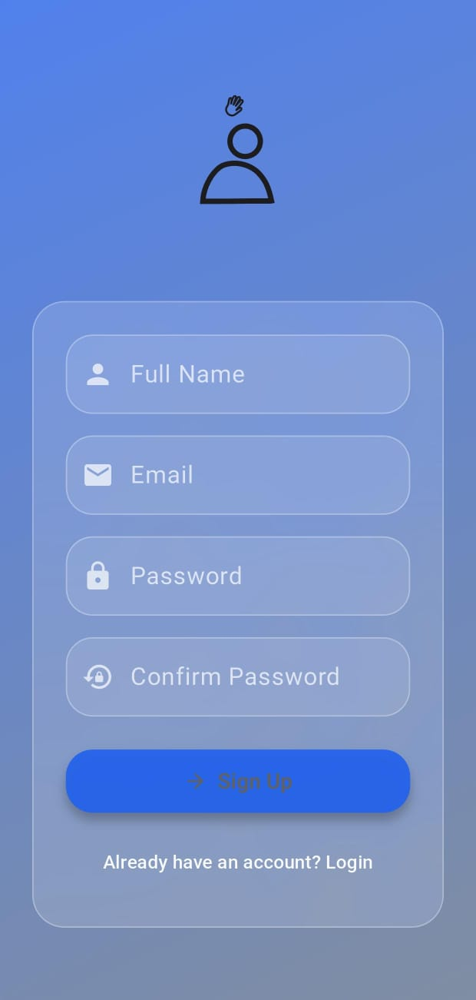
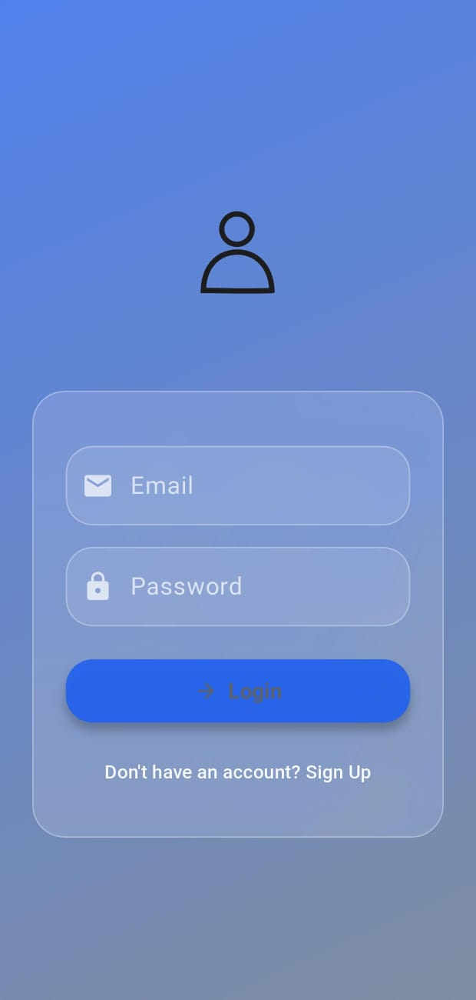

<p align="center">
  
</p>

<h1 align="center">🚀 CareerVerse</h1>

<p align="center">
  <b>AI-powered Career Path Suggestion App</b><br>
  Built using Flutter, Supabase, and a sleek Glassmorphic UI ✨
</p>

<p align="center">
  
  
  
  
</p>

---

## ✨ Features

- 🧠 **AI-driven quiz** to analyze personality traits & suggest best careers
- 💡 **Glassmorphic UI** — frosted cards, soft gradients, and blur effects
- 🔐 **Supabase Auth** — Email/password login & result storage
- 📈 **Career suggestions** with explanations, filters & share options
- 🔁 **Quiz History** — View your past results anytime
- 💬 **Share** your results easily via WhatsApp or other apps

---

## 🎥 Splash Animation

<p align="center">
  
</p>

---

## 📸 App Screenshots

<p align="center">
  
  
  
  
</p>

---

## 🛠️ Tech Stack

| Area             | Technology                               |
|------------------|-------------------------------------------|
| **UI**           | Flutter (Material 3), Google Fonts        |
| **Animations**   | Lottie, flutter_animate                   |
| **State Management** | Provider                             |
| **Backend & Auth** | Supabase                               |
| **Local DB**     | Isar DB                                   |
| **Sharing**      | share_plus                                |
| **i18n**         | intl                                       |

---

## 💼 App Usage

1. 🔐 **Sign Up / Log In** using Supabase  
2. 📝 **Take the AI Career Quiz** – 10+ smart personality questions  
3. 📊 **View Your Recommended Careers**  
4. 🎯 **Filter** using Trait Chips  
5. 🔍 Tap any **Career Card** for full detail (skills, courses)  
6. 📤 **Share Results** via WhatsApp, email, etc.  
7. 📂 **Check History** stored securely in Supabase  

---

## 🧠 Folder Structure

```bash
lib/
├── screens/
│   ├── auth/         # Login, Signup
│   ├── quiz/         # Quiz UI & logic
│   ├── result/       # Result display + career suggestions
│   └── history/      # Past results from Supabase
├── widgets/          # Reusable UI components
├── data/             # Static data like questions
├── utils/            # AI logic, tag scorers, filters
└── main.dart         # Entry point
```

---

##📦 Installation

```bash
# Clone the repo
git clone https://github.com/rly09/ai_career_navigator.git
cd ai_career_navigator

# Get dependencies
flutter pub get

# Launch the app
flutter run
```

---

##🎯 Contributing
Contributions, issues, and feature requests are welcome!
```bash
# Fork this repository

# Create a feature branch
git checkout -b feature/awesome-feature

# Commit your changes
git commit -m "feat: add awesome feature"

# Push to GitHub
git push origin feature/awesome-feature

# Open a Pull Request 🚀
```

---

## 📬 Contact

- 📧 **Email**: [yogiroshan2005@gmail.com](mailto:yogiroshan2005@gmail.com)  
- 🧑‍💻 **GitHub**: [@rly09](https://github.com/rly09)

---

<p align="center"> Made with ❤️ using <strong>Flutter</strong> & <strong>Supabase</strong> </p> ```
