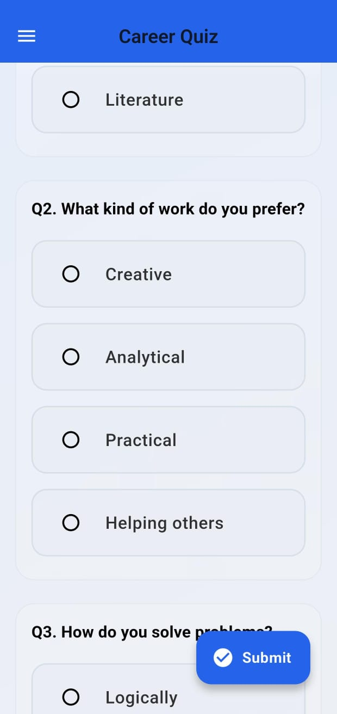

<p align="center">
  
</p>

# 🚀 AI Career Navigator

**AI-powered Career Path Suggestion App**  
Built with Flutter & Supabase — Glassmorphic UI, skill-based quiz, save/share results.

---

## ✨ Features

- **🧠 AI-driven quiz** evaluates your traits & matches 100+ career paths.
- **Glassmorphic design** with elegant blur, frosted cards, and modern colors.
- **Supabase Auth** — Email signup/login & secure result history.
- **Detailed results**—career options with explanations & trait filtering.
- **Save & share** your career path as text or screenshot.

---

## 🎨 Preview

<p align="center">
  
  
  
  
</p>

<p align="center">
  
</p>

---

## 🛠️ Getting Started

### Requirements
- Flutter 3.10+
- Dart 3.6+
- Supabase account & project

### Installation

```bash
# Clone the repo
git clone https://github.com/rly09/ai_career_navigator.git
cd ai_career_navigator

# Install dependencies
flutter pub get

# Run the app
flutter run
```

📝 Setup Configuration
Supabase
Create a project and add client credentials in .env or initialize via SupabaseFlutter.initialize(...).

Assets

assets/auth.json for Lottie animations

assets/icons/app_icon.png for splash and launcher icon

Runner (Android/iOS)
After running splash & icon commands, ensure appropriate files are updated in android/ and ios/ folders.

💼 Usage
Sign Up / Log In

Take the AI quiz — choose options that match your interests

View Recommended Careers with explanations and traits

Tap a career card to see detailed info

Share or revisit results via History, powered by Supabase

🔧 Technologies Used
Feature	Tool / Package
UI & Animations	Flutter, flutter_animate, Lottie
Data & Auth	Supabase, http
Local Storage	Isar
State Management	Provider
Share Functionality	share_plus
Internationalization	intl

🎯 Contributing
Your ideas are welcome!

Fork the repo

Create a feature branch (git checkout -b feature/…)

Commit your changes (git commit -m "feat: add …")

Push (git push origin feature/…)

Open a Pull Request

📝 License
MIT © [Your Name]

📲 Contact
Have questions or feedback?

Email: your.email@example.com

Twitter: @yourhandle

